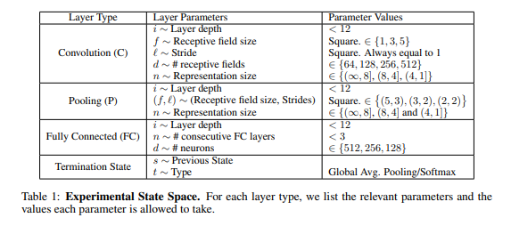

# References

- Neural Architecture Search with Reinforcement Learning ([ArxiV](https://arxiv.org/abs/1611.01578))

  **This is the one we should get inspiration from if we were to implement this idea with `Aesara`**

- Designing Neural Network Architectures using Reinforcement Learning (2017) ([ArXiv](https://arxiv.org/abs/1611.02167))

  <figure>
  
  <figcaption>State space of the model search</figcaption>
  </figure>

  These state space descriptions can be easily written in the form of [[minikanren|miniKanren]] constraints and rewrite rules.

- A Genetic Programming Approach to Designing Convolutional Neural Network Architectures (2017) ([ArXiv](https://arxiv.org/abs/1704.00764)) ([Github](https://github.com/sg-nm/cgp-cnn))

  > The convolutional neural network (CNN), which is one of the deep learning models, has seen much success in a variety of computer vision tasks. However, designing CNN architectures still requires expert knowledge and a lot of trial and error. In this paper, we attempt to automatically construct CNN architectures for an image classification task based on Cartesian genetic programming (CGP). In our method, we adopt highly functional modules, such as convolutional blocks and tensor concatenation, as the node functions in CGP. The CNN structure and connectivity represented by the CGP encoding method are optimized to maximize the validation accuracy. To evaluate the proposed method, we constructed a CNN architecture for the image classification task with the CIFAR-10 dataset. The experimental result shows that the proposed method can be used to automatically find the competitive CNN architecture compared with state-of-the-art models.

- Accelerating Neural Archistecture Search using Performance Prediction ([ArXiv](https://arxiv.org/abs/1705.10823))

- Neural Architecture Search: A survey ([ArXiv](https://arxiv.org/abs/1808.05377))

  > Deep Learning has enabled remarkable progress over the last years on a variety of tasks, such as image recognition, speech recognition, and machine translation. One crucial aspect for this progress are novel neural architectures. Currently employed architectures have mostly been developed manually by human experts, which is a time-consuming and error-prone process. Because of this, there is growing interest in automated neural architecture search methods. We provide an overview of existing work in this field of research and categorize them according to three dimensions: search space, search strategy, and performance estimation strategy.

- A Survey on Neural Architecture Search ([ArXiv](https://arxiv.org/abs/1905.01392))

  > The growing interest in both the automation of machine learning and deep learning has inevitably led to the development of a wide variety of automated methods for neural architecture search. The choice of the network architecture has proven to be critical, and many advances in deep learning spring from its immediate improvements. However, deep learning techniques are computationally intensive and their application requires a high level of domain knowledge. Therefore, even partial automation of this process helps to make deep learning more accessible to both researchers and practitioners. With this survey, we provide a formalism which unifies and categorizes the landscape of existing methods along with a detailed analysis that compares and contrasts the different approaches. We achieve this via a comprehensive discussion of the commonly adopted architecture search spaces and architecture optimization algorithms based on principles of reinforcement learning and evolutionary algorithms along with approaches that incorporate surrogate and one-shot models. Additionally, we address the new research directions which include constrained and multi-objective architecture search as well as automated data augmentation, optimizer and activation function search.
